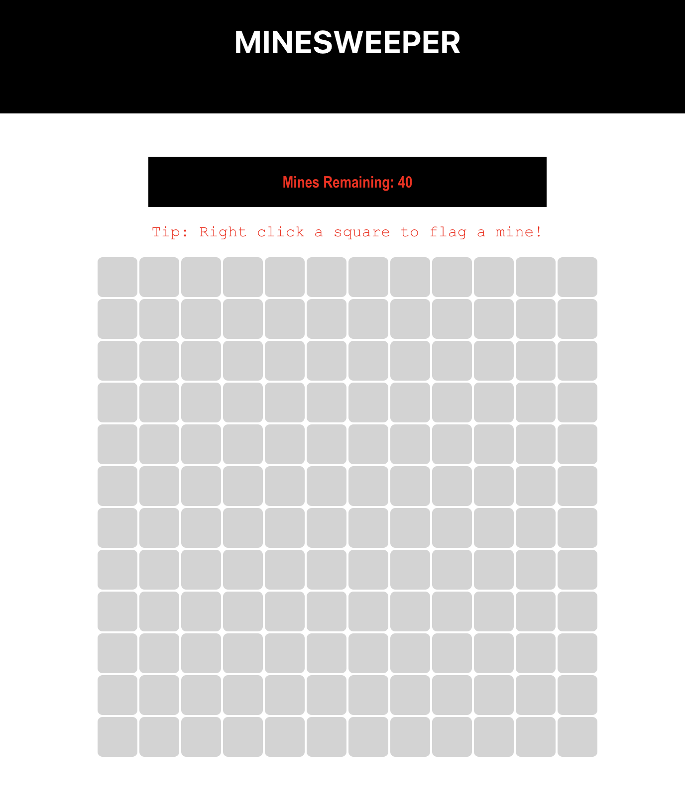

# Minesweeper 💣

Before we take a break from grid-based challenges, your dastardly dare for this week is to recreate the logic behind the classic [Minesweeper](https://minesweeper.online/) game. Given a grid of characters where each `X` represents a mine and each `-` represents empty space, the aim is to return a grid where each `-` is replaced by an integer indicating the number of mines adjacent to that spot (including diagonally).

Rewards:

5️⃣ Points are awarded for a working solution.

3️⃣ Further points are awarded for creating a playable game (i.e. a working GUI).

2️⃣ Further points are awarded for creating more than one difficulty level in your playable game.

## Live App

The app is deployed on GitHub Pages and can be played [here](https://natasha-mann.github.io/minesweeper).

## Run Locally

If you want to run the app locally, clone the repo and install the packages:

```
git clone git@github.com:natasha-mann/minesweeper.git
cd minesweeper
npm i
```

To run the application:

```
npm run start
```

## Tests

Run the tests for the application with:

```
npm run test
```

## Screenshot


